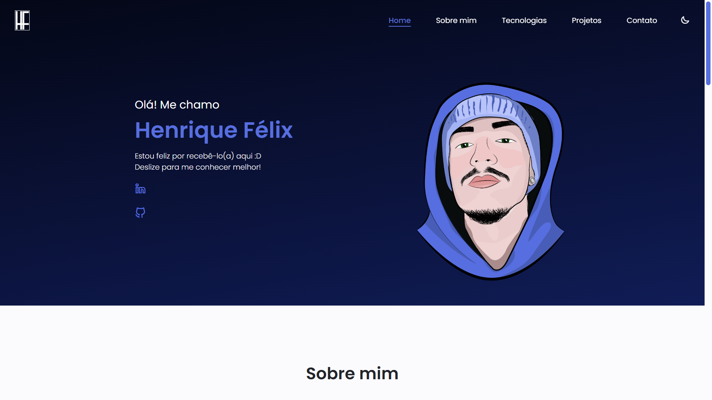
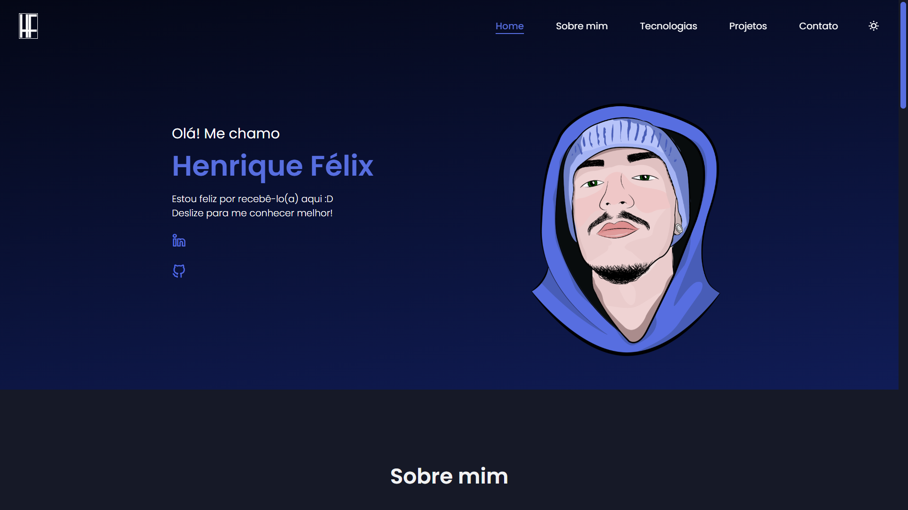
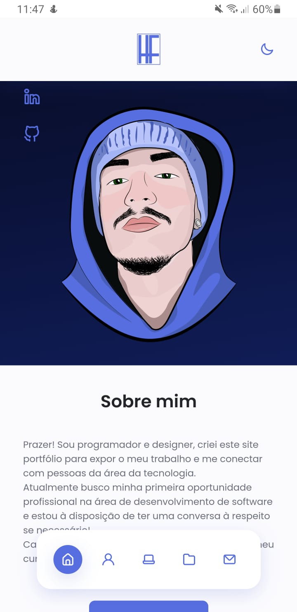
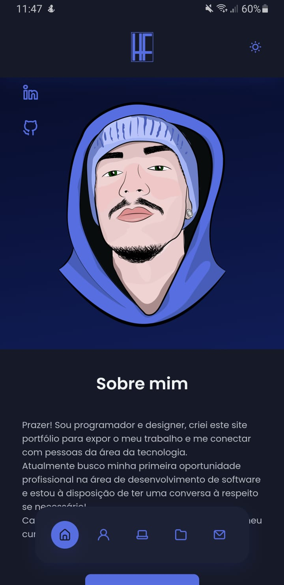

    </img>

<h1 align="center"> Henrique Félix | Portfolio </h1>

---

---

     
    
    
    

---

<h3 align="center">
    LICENSE
</h3>

    

---

<h3 align="center">
    PREVIEW
</h3>

    Light mode on desktop.

    

    Dark mode on desktop.

    

    Light and dark mode on mobile device.

    
    

    Browsing the site

    

---

<h3>ABOUT THE PROJECT</h3>

    This project is a portfolio that I developed in order to publicize my work, in it I will be posting my future projects and I will always keep it updated. 
    If you find any bugs or want to leave a suggestion, get in touch on any of my social networks or in the CONTACT section on the website.

---

<h3>FEATURES</h3>

- Responsive website;
- Light and dark mode;
- Local storage to save the current theme;
- Intuitive button navigation;
- Form with validations and feedback messages;
- Email sending via smtpjs API.

<h3>TECHNOLOGIES USED</h3>

- [HTML](https://www.w3.org/html/)
- [CSS](https://www.w3schools.com/css/default.asp)
- [Javascript](https://www.javascript.com)
- API's
  - [Swiper](https://swiperjs.com)
  - [SMTPJS](https://smtpjs.com)
